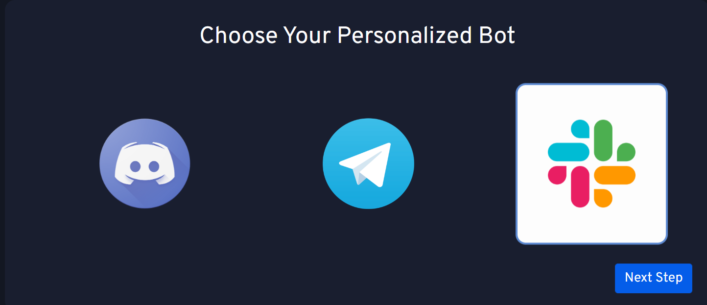
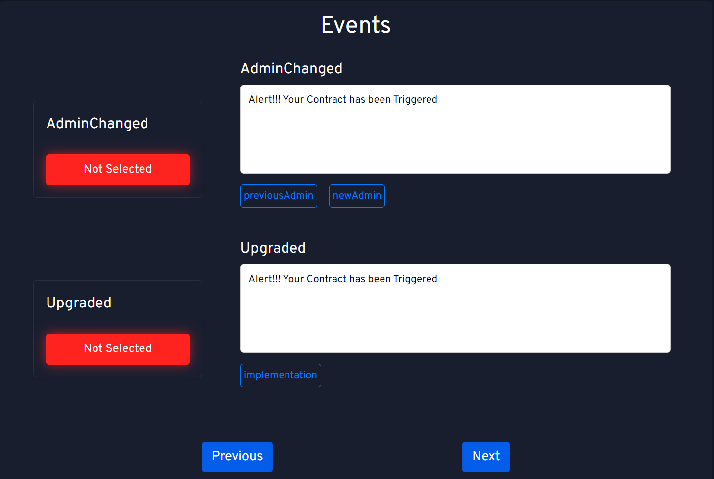

# Slack bot

You can create your own Slack bot easily by using our bot section...

## Create a Slack Bot

1. Choose `Slack Icon` and click on it under bot section

2. Enter your contract address, telegram bot token, chat id and ABi of your smart contract.

:::info

You can get slack bot url from [here](https://api.slack.com/bot-users), and ABI from [Etherscan](https://etherscan.io/)

:::

:::danger Caution

Make sure your contract is verified and ABI is not null

:::

3. Select the events you want to listen to and click on `Next` button

:::caution

Select at least one event.

:::

4. Finally, pay for your bot and download the zip file

Congratulations, you have made your own Telegram bot!

## Deploy your bot

To deploy your bot, checkout our [deployment](/deployment/intro) section.
